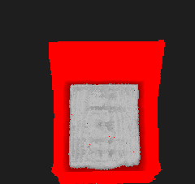

# LIDAR — Анализ загрузки кузова грузовика

Обработка данных промышленного LiDAR-сканера для определения высоты загрузки кузова грузовика. Программа аппроксимирует плоскость дна кузова алгоритмом RANSAC с МНК-уточнением и генерирует карту отклонений (heatmap), визуализирующую инлайеры (дно) и выбросы (снег, пыль, груз).

## Сборка

**Требования:** CMake ≥ 3.24, компилятор с поддержкой C++23.

```bash
cmake -S . -B build && cmake --build build 
```

Зависимость [nlohmann/json](https://github.com/nlohmann/json) подтягивается автоматически через `FetchContent`.

## Запуск

```bash
./build/lidar.x <depth_map.png> <mask.json>
```

- `depth_map.png` — 16-bit grayscale PNG с картой глубин (значения в мм)
- `mask.json` — JSON с полигоном границ кузова

Результат сохраняется в `assets/output/deviation_map.png`.

### Формат mask.json

```json
{
  "objects": [
    {
      "data": [
        [x1, y1],
        [x2, y2],
        [x3, y3]
      ]
    }
  ]
}
```

Координаты `(x, y)` — `(столбец, строка)` в пикселях depth map.

## Структура проекта

```
├── main.cpp                          # Точка входа
├── CMakeLists.txt
├── include/
│   ├── geometry/                     # Примитивы: Vector3D, Plane, Line, Triangle
│   ├── lidar/
│   │   ├── lidar_processor.hpp       # Облако точек, RANSAC, конфиг LiDAR
│   │   └── deviation_map.hpp         # Рендерер карты отклонений
│   ├── math/
│   │   └── math.hpp                  # Константы, сравнение с допуском
│   └── third_party/
│       ├── stb_image.h
│       └── stb_image_write.h
├── source/
│   ├── geometry/                     # Реализация геометрических примитивов
│   └── lidar/
│       ├── lidar_processor.cpp       # extract_cloud, fit_plane_ransac
│       └── deviation_map.cpp         # render_deviation_map
└── assets/
    ├── images/                       # Входные depth map (clean / medium / heavy)
    ├── body_boreders/                # JSON-маски кузовов
    └── output/                       # Сгенерированные heatmap
```

## Алгоритм

1. **Загрузка** — 16-bit depth map (PNG) и JSON-маска кузова.
2. **Извлечение облака точек** — пиксели внутри маски переводятся в 3D-координаты 
3. **Реконструкция** — перевод 16-битных значений яркости и координат пикселей в 3D-точки (мм) с учетом параметров LiDAR (угол, шаг, время, скорость грузовика).
4. **RANSAC** — итеративный поиск плоскости с максимальным числом инлайеров (порог — 20 мм).
5. **МНК-уточнение** — ковариационная матрица инлайеров → собственный вектор с минимальным собственным значением.
6. **Визуализация** — heatmap: серый = инлайер (дно), красный = выброс (интенсивность пропорциональна отклонению).

## Конфигурация LiDAR

| Параметр | Значение по умолчанию | Описание |
|---|---|---|
| `angle_min_deg` | -30.0° | Начальный угол сканирования |
| `angle_step_deg` | 0.25° | Шаг угла между лучами |
| `scan_time_step_sec` | 0.02 с | Время между строками сканирования |
| `truck_speed_mm_s` | 5000 мм/с | Скорость движения грузовика |

## Примеры работы

### Входная карта глубин


### Карта отклонений (Heatmap)

